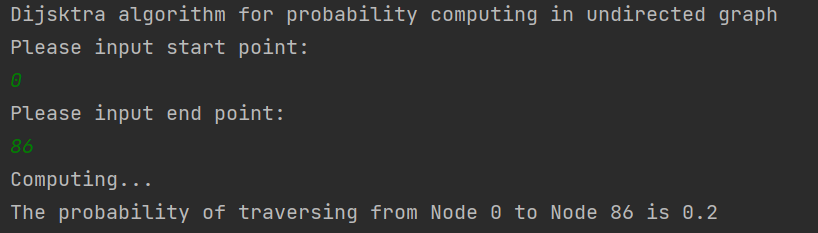

# Link-Prection-and-Probability-Computing-on-Knowledge_Graph

## Probability Computing

#### 1. Dijsktra on undirected graph

#### 2. BFS on undirected graph

#### 3.BFS bitop on undirected graph

## Link Predction

# Link-Prection-and-Probability-Computing-on-Knowledge_Graph
